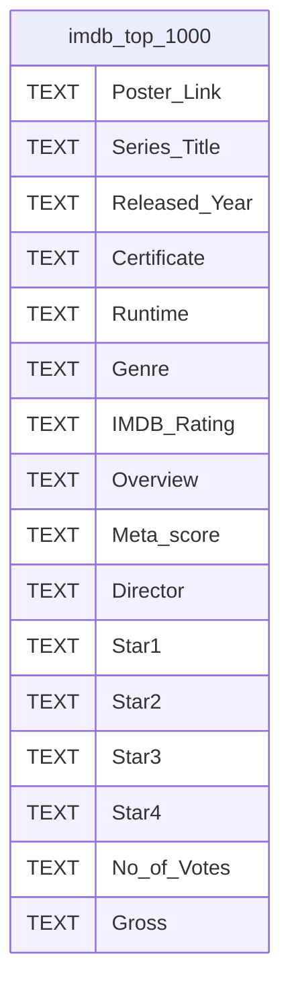
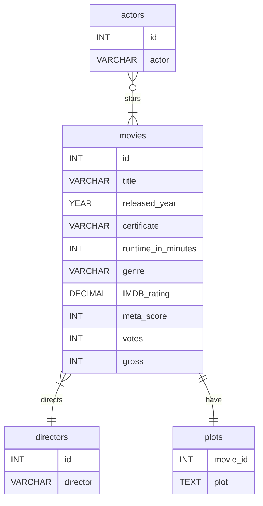

# Projeto de Analise de Dados

Este projeto tem por objetivo a criação e análise de uma Database dos top 1000 filmes do IMDB (internet movie database).

## Tecnologias Utilizadas

- Python notebook
- MySQL

## Schema

Nossos dados Brutos começam com o seguinte ER diagram (diagrama de relação de entidades):



Após a limpeza de dados, teremos ao final o seguinte ER diagram.
Onde serão gerados insights a partir de determinadas `VIEWS` e `PROCEDURES`



## Setup

Para aqueles que nao apenas desejam ver os resultados, mas também acompanhar seu desenvolvimento, é necessário primeiramente clonar o repositório.

```
git clone https://github.com/Costa-LG/Movies-Data-Analysis.git
cd Movies-Data-Analysis
```

### Criando o ambiente virtual

```
python -m venv venv
venv\Scripts\activate # Windows
source venv/bin/activate # Linux
```

### Instalando Dependências

```
pip install -r requirements.txt
```

## Passos

Terminada as preparações, aqui estão ordenados os próximos passos, assim como os arquivos correspondentes do repositório.

1. Cleaning_Data.ipynb
> Como o nome indica, este notebook contém um programa em `pandas` para a limeza de dados.
2. schema.sql
> Neste arquivo foram criadas as devidas tabelas em `MySQL`

